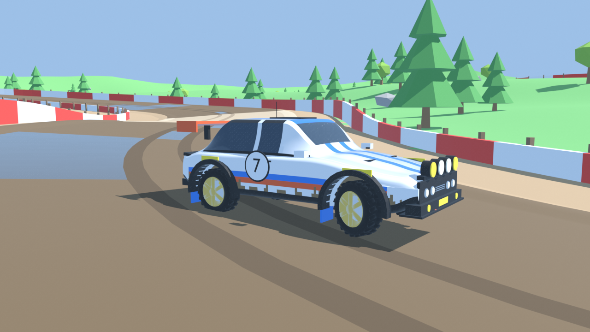

# Arcade Rally

A Sega-Rally-style arcade racer that runs in the browser: drift through mud and gravel, charge your boost,
hit the boost pads and beat your best lap. Works on desktop (keyboard / gamepad) and on phones (touch controls,
starts in fullscreen).

**▶ Play: https://madd1in.github.io/arcade-rally/**

## Controls

| | Keyboard | Gamepad | Touch |
|---|---|---|---|
| Drive / brake | W / S | RT / LT | GAS / BRAKE |
| Steer | A / D | left stick | ◀ ▶ |
| Drift | Space | B | DRIFT |
| Boost (charged by drifting) | Shift | A | BOOST |
| Reset to last checkpoint | R | Y | – |
| Pause | Esc | Start | II |

Surfaces matter: tarmac grips, gravel slides, mud slides even more and slows you down — but drifting through
mud charges the boost fastest.

## How it was made

- **Blender** — track, terrain, scenery, gates and the widebody rally car were modelled procedurally
  (exported as Draco-compressed glTF).
- **Three.js** — rendering; the physics follows the track's analytic cross-section (bank, crown, shoulders),
  so it matches the mesh exactly and stays fast on phones.
- **Audio** — announcer, engine/skid loops, SFX and music. The current files are stand-ins; the ElevenLabs
  versions are generated from the same manifest in the Unreal project.
- **Figma** — HUD and mobile touch layout.

The same assets also drive an Unreal Engine 5.8 version of the game.
